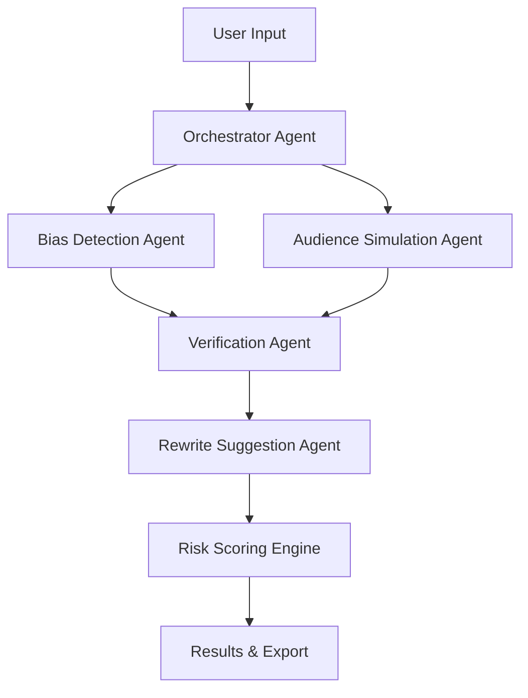

<div align="center">

# ⚡ PulseForge

### Real-Time Bias & Tone Auditing for Creative Teams


https://github.com/user-attachments/assets/4ea1a618-4137-4e4b-a2b5-35475664f433


*An agentic AI platform that helps enterprises scale content responsibly*

[](https://nextjs.org/)
[](https://fastapi.tiangolo.com/)
[](https://www.python.org/)
[](LICENSE)


</div>

---

## 🎯 What is PulseForge?

PulseForge audits creative content—ads, scripts, marketing copy—in real time to detect:

- 🔍 **Judgmental language** that alienates audiences
- 🌐 **Cultural tone mismatches** across global markets
- ⚠️ **Subtle bias** that traditional tools miss

Unlike rule-based systems, PulseForge uses **LLM-driven reasoning** and **synthetic audience simulation** to provide nuanced, context-aware feedback without over-censorship.

### The Problem We Solve

Traditional content moderation is either:
- **Too strict** → blocks harmless content
- **Too loose** → misses subtle bias
- **Rule-based** → can't understand context

PulseForge balances sensitivity with intelligence.

---

## ✨ Features

<table>
<tr>
<td width="50%">

### 🧠 Intelligent Analysis
- Semantic understanding via LLMs
- No hardcoded bias dictionaries
- Context-aware risk detection
- Self-verification to reduce false positives

</td>
<td width="50%">

### 🌍 Global Awareness
- Synthetic audience simulation
- Privacy-safe persona modeling
- Cultural nuance detection
- Regional tone matching

</td>
</tr>
<tr>
<td width="50%">

### ✍️ Actionable Insights
- Phrase-level rewrite suggestions
- Clear risk scoring (🟢 🟡 🔴)
- Explainable recommendations
- Audit-friendly reports

</td>
<td width="50%">

### 📊 Enterprise Ready
- Shareable report links
- One-click PDF export
- Performance tracking
- Scalable architecture

</td>
</tr>
</table>

---

## 🏗️ Architecture

PulseForge uses an **agentic design** where specialized AI agents handle distinct tasks:



### Component Breakdown

| Layer | Responsibility | Why It Matters |
|-------|---------------|----------------|
| **LLMs** | Semantic reasoning, cultural nuance | Understands context, not just keywords |
| **Agents** | Single-responsibility intelligence | Focused, testable, maintainable |
| **Verification** | Cross-checks findings | Prevents hallucinations & false flags |
| **Risk Engine** | Deterministic scoring | Explainable, consistent decisions |
| **UI** | Human-readable insights | Actionable feedback for teams |

> **Philosophy**: Use LLMs for reasoning, but keep final decisions deterministic and explainable.

---

## 🚀 Quick Start

### Prerequisites

- Node.js 18+
- Python 3.11+
- GitHub Token (for LLM access)

### Installation

**1. Clone the repository**
```bash
git clone https://github.com/yourusername/pulseforge.git
cd pulseforge
```

**2. Set up backend**
```bash
cd backend
pip install -r requirements.txt

# Create .env file
echo "GITHUB_TOKEN=ghp_your_token_here" > .env
echo "GITHUB_MODEL=gpt-4o" >> .env

# Run server
uvicorn main:app --reload
```

**3. Set up frontend**
```bash
cd frontend
npm install
npm run dev
```

**4. Open your browser**
```
http://localhost:3000
```

---

## 🧪 Example Analysis

### Input
```
People who lack discipline often fail at personal growth — our product fixes that problem.
```

### Output

**Status**: 🔴 RED

**Issues Detected**:
- Judgmental framing ("lack discipline")
- Blame-oriented language
- Cultural insensitivity (Western bias)

**Suggested Rewrites**:
1. "Building consistent habits supports personal growth — our product makes it easier."
2. "Many find structure helpful for achieving goals — we're here to support that journey."
3. "Our product helps you develop routines that align with your personal growth goals."

---

## 📊 Risk Scoring System

| Status | Score Range | Meaning |
|--------|------------|---------|
| 🟢 **GREEN** | 80-100 | Safe & inclusive content |
| 🟡 **YELLOW** | 50-79 | Localized or soft tone risks |
| 🔴 **RED** | 0-49 | Judgmental or harmful framing |

---

## 🛠️ Tech Stack

### Frontend
- **Next.js 14** - React framework with App Router
- **Tailwind CSS** - Utility-first styling
- **Framer Motion** - Smooth animations
- **Recharts** - Data visualization
- **jsPDF + html2canvas** - PDF export

### Backend
- **FastAPI** - High-performance Python API
- **GitHub Models** - Secure LLM access via GitHub Token
- **Pydantic** - Data validation
- **Agentic Architecture** - Modular AI design

### Why GitHub Models?

✅ No credit card required  
✅ Enterprise-grade authentication  
✅ Easy token rotation  
✅ Safer for team environments  

---

## 🔄 Analysis Flow

```
1. User submits content
   ↓
2. Bias & Tone Agent analyzes semantically
   ↓
3. Audience Agent simulates regional reactions
   ↓
4. Verification Agent confirms risks
   ↓
5. Rewrite Agent generates alternatives
   ↓
6. Risk Engine computes final score
   ↓
7. Results displayed (shareable + exportable)
```

---

## 📖 Documentation

### API Endpoints

#### `POST /analyze`
Analyzes content for bias and tone issues.

**Request:**
```json
{
  "content": "Your content here"
}
```

**Response:**
```json
{
  "risk_assessment": {
    "safety_score": 85,
    "status": "GREEN"
  },
  "audience_reactions": [...],
  "rewrite_suggestions": {...}
}
```

### Configuration

Create a `.env` file in the backend directory:

```env
GITHUB_TOKEN=ghp_xxxxxxxxxxxxx
GITHUB_MODEL=gpt-4o
PORT=8000
```

---

## 🎨 Screenshots

<div align="center">

### Dashboard Overview
![Dashboard]


### Analysis Results
![Results]


</div>

---

## 🔮 Roadmap

- [ ] **Multi-LLM Voting** - Consensus-based decisions
- [ ] **Confidence Indicators** - Visual certainty scores
- [ ] **Industry Templates** - Finance, healthcare, education policies
- [ ] **Multilingual Support** - Analyze content in 20+ languages
- [ ] **Database Integration** - Persistent analysis history
- [ ] **API Authentication** - Team-based access control
- [ ] **Batch Processing** - Analyze multiple files at once
- [ ] **Custom Policies** - Organization-specific guidelines

---

## 🤝 Contributing

Contributions are welcome! Please read our [Contributing Guidelines](CONTRIBUTING.md) before submitting PRs.

### Development Setup

```bash
# Install development dependencies
pip install -r requirements-dev.txt
npm install --save-dev

# Run tests
pytest
npm test

# Format code
black .
prettier --write .
```

---

## 📝 Design Philosophy

> "Avoid hardcoded ethics. Use LLMs for reasoning, but keep final decisions deterministic."

PulseForge is built on three principles:

1. **Transparency** - Every decision is explainable
2. **Verification** - LLMs are cross-checked to prevent hallucinations
3. **Balance** - Sensitive without over-censorship

This approach creates AI systems that are trustworthy, not just powerful.

---

## 📄 License

This project is licensed under the MIT License - see the [LICENSE](LICENSE) file for details.

---

## 👤 Author

**Umangi Nigam**  
AI Intern @ Yellow.ai  

Focused on Agentic AI, Trustworthy LLMs, and Ethical AI Systems

---

## 🙏 Acknowledgments

- GitHub Models for accessible LLM infrastructure
- The open-source community for amazing tools
- Early testers who provided valuable feedback

---

<div align="center">

### ⭐ If PulseForge helps your team, consider starring the repo!

**Built with ❤️ for enterprises scaling AI responsibly**

[Report Bug](https://github.com/yourusername/pulseforge/issues) • [Request Feature](https://github.com/yourusername/pulseforge/issues) • [Documentation](https://docs.pulseforge.dev)

</div>
